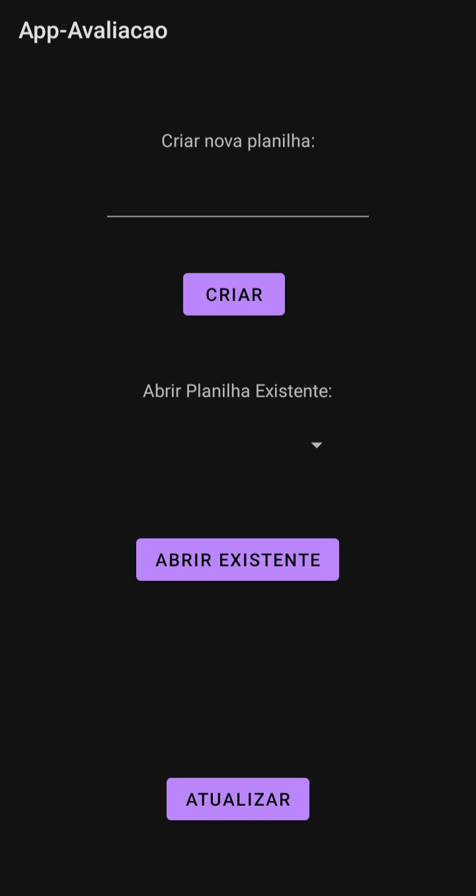
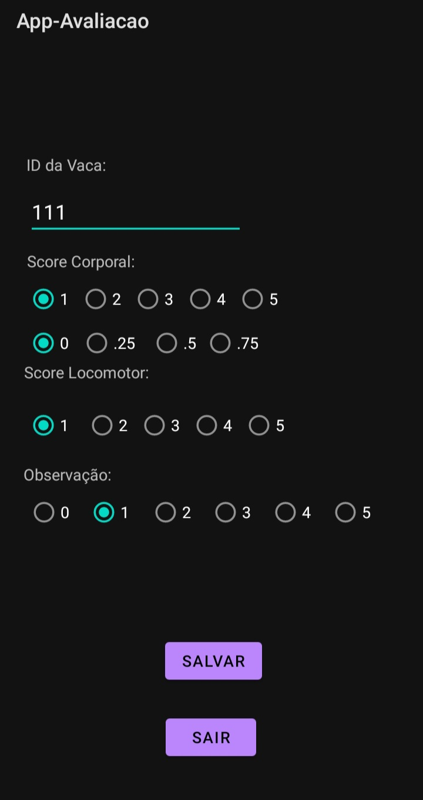
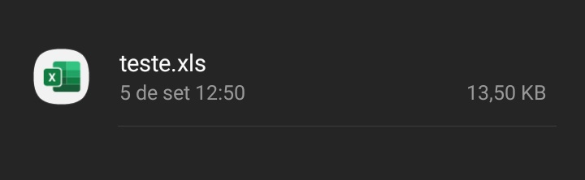
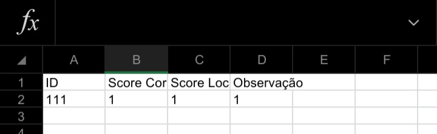

<h1 align="center">🐄 Vet Help 🐄 </h1>

<a href="https://www.linkedin.com/feed/update/urn:li:activity:6846870779393646592/"> Vídeo do Projeto </a>

  

 ### Tabela de Conteúdos
   * [Descrição](#Descrição)
   * [Funcionalidades](#funcionalidades)
   * [Exemplo de Tabela](#exemplo)
   * [Imagens](#Imagens)

 

## Descrição

Este projeto foi desenvolvido para ajudar na avaliação de Vacas, visto que, para o profissional em campo era necessário anotar no papel, depois transformar em planilha. Esse aplicativo ajuda nisso, já transformando os dados em planilhas de excel, prontas para o cliente final. 
O desenvolvimento foi feito em Java, usando o Android Studio em dois dias. 

 

## Funcionalidades  

- [X] Cadastro de Novas Vacas
- [X] Criação automática de Planilha 📝

 

## Exemplo: 
|ID|Score Corporal|Score Locomotor|Observação|
| -------- | -------- | -------- |-------- |
|111|1|1|1

## Imagens:

<h3 align="center">Tela inicial</h3>

 

<h3 align="center">Preenchimento</h3>

 

<h3 align="center">Arquivo .xls</h3>

 

<h3 align="center">Tabela Final</h3>

 
